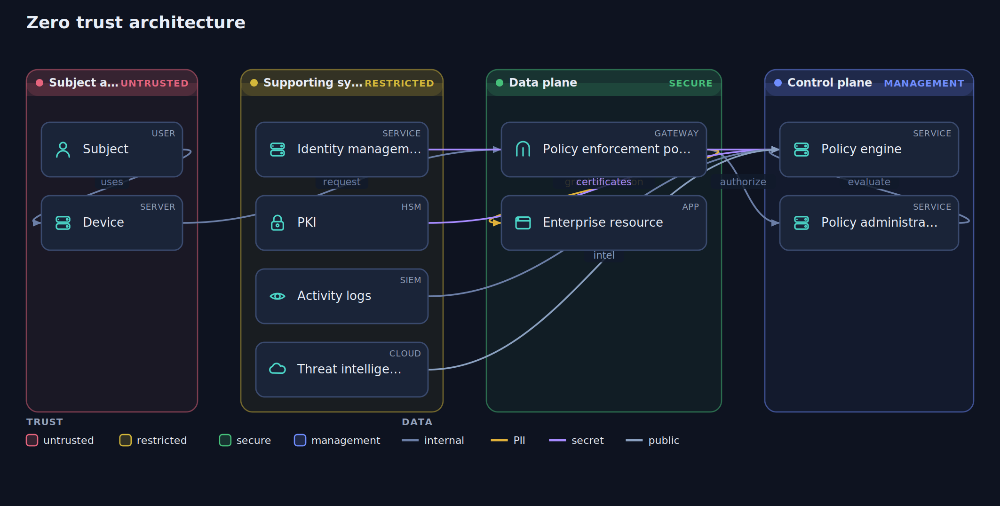

# Hisn

Security and compliance reference architectures as code. You write a short text
description of a system as trust zones, the components inside them, and the data
that flows between those components, and Hisn draws a blueprint: the zones ordered
by trust, the components typed and glyphed, the flows colored by data
classification with boundary crossings marked, and the controls each element maps
to. The output is one self contained interactive HTML file with no dependencies
and no server.

It comes with reference blueprints for three frameworks that come up constantly in
banking and payments work: PCI DSS, the SWIFT customer security programme, and
Zero Trust.

**Try it in your browser: https://siteq8.github.io/Hisn/**


## The idea

A security architecture review usually starts with the same picture: where the
trust boundaries are, what sits in each zone, which data crosses which boundary,
and which control covers each step. Hisn treats that picture as code.

- **Trust tiers.** Each zone declares a trust level, and the bands are laid out
  from least trusted on the left to most trusted on the right, so the diagram
  reads as defence in depth.
- **Data classification.** Every flow is classified as public, internal, PII,
  cardholder data, or secret, and colored to match, so the sensitive paths stand
  out and a flow that crosses a boundary is visibly a crossing.
- **Control mapping.** A component or a flow can carry the controls it satisfies,
  a PCI requirement, a SWIFT CSCF control, a Zero Trust component, printed right
  on the blueprint.

Hisn is a sibling to a threat modelling tool: where a threat model asks what could
go wrong, a blueprint states the intended shape of the architecture and where the
controls sit.

## The language

A blueprint is a `.hisn` file. Every line is one statement, text after a hash is a
comment, and labels are in double quotes.

```
title PCI DSS cardholder data environment
framework pci

zone internet "Internet" trust=untrusted
zone dmz "DMZ" trust=dmz
zone cde "Cardholder data environment" trust=secure
zone mgmt "Management" trust=management

component cardholder "Cardholder" zone=internet type=user
component waf "Web application firewall" zone=dmz type=waf controls="Req 6.6"
component app "Payment application" zone=cde type=app
component vault "Cardholder data store" zone=cde type=db controls="Req 3.4"
component hsm "Key management HSM" zone=cde type=hsm controls="Req 3.5, 3.6"
component siem "Logging and monitoring" zone=mgmt type=siem controls="Req 10.2"

flow cardholder -> waf "HTTPS" data=chd controls="Req 4.1"
flow waf -> app "tokenize" data=chd controls="Req 3.4"
flow app -> vault "store token" data=chd
flow app -> hsm "encrypt" data=secret controls="Req 3.5"
flow app -> siem "audit log" data=internal controls="Req 10.2"
```

Statements:

- `title <text>` names the blueprint.
- `framework <pci|swift|zerotrust>` records the framework, and is shown on the
  share card.
- `zone <id> "Label" trust=<level>` declares a trust zone. Levels, from least to
  most trusted, are untrusted, dmz, restricted, secure, and management.
- `component <id> "Label" [zone=<id>] [type=<type>] [controls="a, b"]` places a
  component in a zone. Types are user, internet, firewall, waf, gateway, proxy,
  lb, server, app, api, db, store, queue, hsm, ids, siem, cloud, and service.
- `flow <a> -> <b> ["label"] [data=<class>] [controls="a, b"]` draws a data flow.
  Classes are public, internal, pii, chd, and secret. A component named only in a
  flow is created automatically.

## The three blueprints

Print any of them to start from, then edit for your environment:

```
npx github:SiteQ8/Hisn template pci        > cde.hisn
npx github:SiteQ8/Hisn template swift      > swift.hisn
npx github:SiteQ8/Hisn template zerotrust  > zta.hisn
```

- **pci** is a PCI DSS cardholder data environment: the card holder reaching a web
  application firewall in the DMZ, tokenisation into the cardholder data
  environment, a key management HSM, and logging, with requirement references on
  the elements they cover.
- **swift** is the SWIFT customer security programme secure zone: operator PCs
  reaching the secure zone only through a jump server, the messaging and
  communication interfaces, an HSM, and the path out to SWIFTNet, with CSCF
  control references.
- **zerotrust** is the NIST logical model: subject and device, a policy
  enforcement point, the policy engine and administrator on the control plane, the
  enterprise resource, and the supporting systems that feed the decision.



## The viewer

Every blueprint Hisn generates is interactive. A reader can pan and zoom, **click a
component to light up every data flow it takes part in** and the components at the
other end, and export a clean SVG, a PNG, or a 1200 by 630 share card. It is all in
the one file, so it opens in any browser with nothing installed.

## Install and use

Hisn is a zero dependency Node tool. Run it without installing:

```
npx github:SiteQ8/Hisn render cde.hisn -o cde.html
npx github:SiteQ8/Hisn render cde.hisn -o cde-light.html --theme light
npx github:SiteQ8/Hisn card cde.hisn -o cde-card.svg
npx github:SiteQ8/Hisn serve --open
```

Or clone it and call `node bin/hisn.mjs`. It needs Node 18 or newer and nothing
else. There is no build step and no bundle: the same engine under `docs/app` runs
the command line and the browser demo.

## Honest scope

Hisn draws reference architectures, it does not assess or certify one. A template
is a starting point for a real design, not evidence of compliance, and the control
references on it show where a control belongs, not that it is implemented. The
blueprint is a graph of components and the data between them, not a model of a
running system: it will not find a misconfiguration or prove segmentation. Read it
as a shared picture to design and review against, and confirm the real controls
with the framework itself.

## License

MIT. See [LICENSE](LICENSE).
