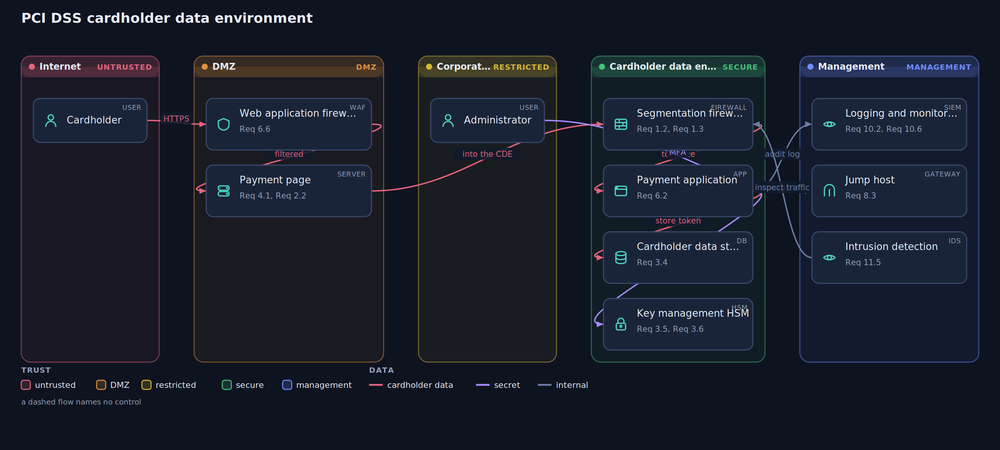
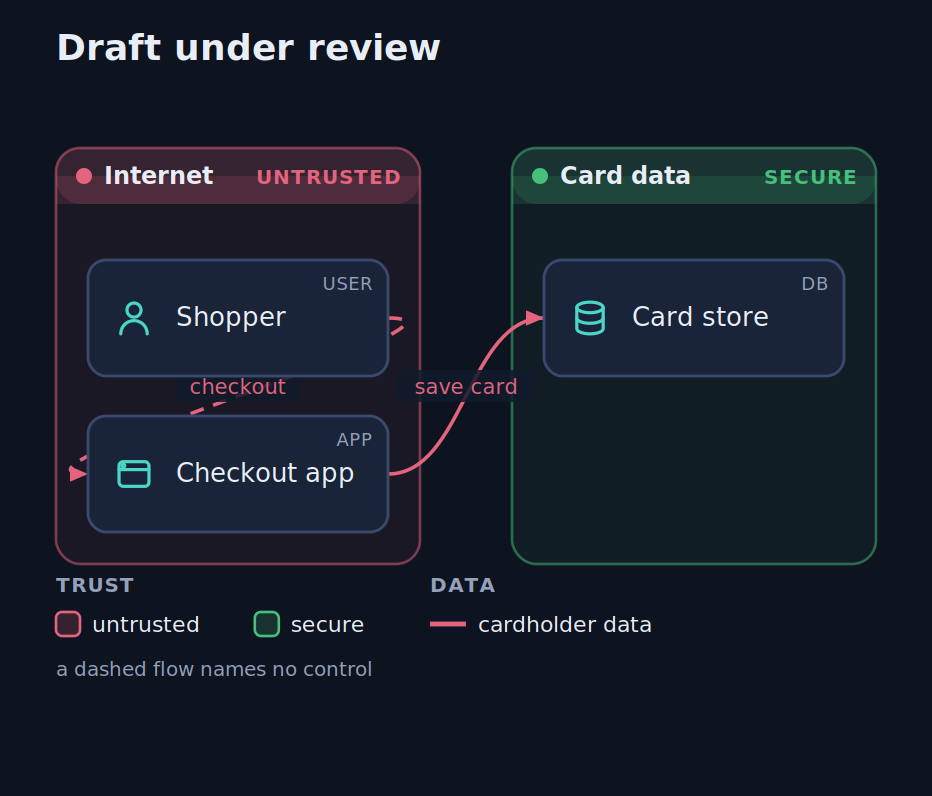
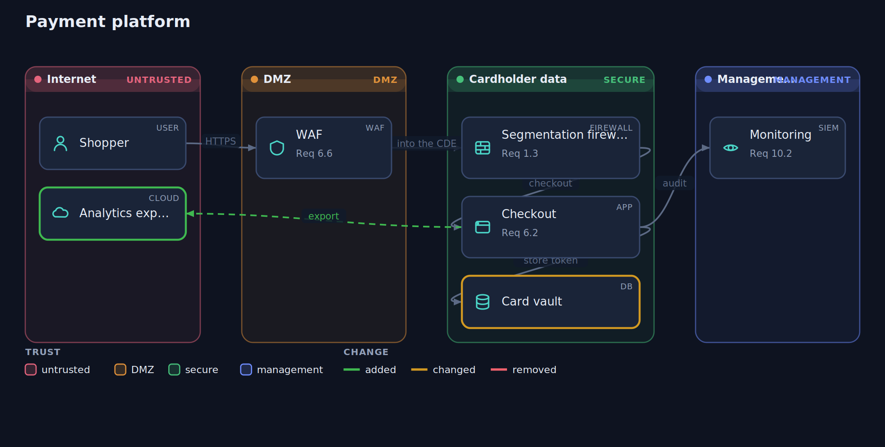
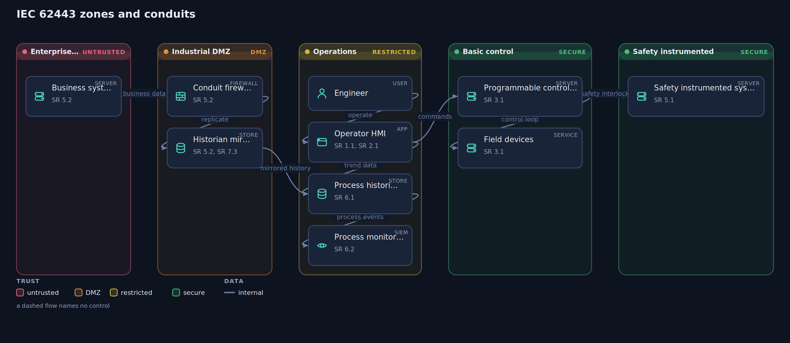

# Hisn

Security and compliance reference architectures as code. You write a short text
description of a system as trust zones, the components inside them, and the data
that flows between them. Hisn draws the blueprint and then reviews it: zones
ordered by trust, components typed and glyphed, flows colored by data
classification, boundary crossings marked, controls printed where they belong, and
a report of the gaps it can see.

The output is one self contained interactive HTML file. No dependencies, no
server, no build step.

**Try it in your browser: https://siteq8.github.io/Hisn/**



## Eleven frameworks, ready to start from

| | |
| --- | --- |
| `pci` | PCI DSS cardholder data environment, with requirement references |
| `swift` | SWIFT customer security programme secure zone, with CSCF references |
| `zerotrust` | Zero trust architecture, the NIST logical model |
| `hipaa` | HIPAA security rule ePHI environment |
| `gdpr` | GDPR personal data processing, with article references |
| `soc2` | SOC 2 production environment, with trust services criteria |
| `iso27001` | ISO 27001 information security zones, with Annex A references |
| `iec62443` | IEC 62443 zones and conduits for industrial control systems |
| `nca` | NCA essential cybersecurity controls, with ECC subdomain references |
| `nis2` | NIS2 essential entity systems, with Article 21 and 23 references |
| `cis` | CIS Controls enterprise environment |

```
npx github:SiteQ8/Hisn template pci > cde.hisn
npx github:SiteQ8/Hisn render cde.hisn -o cde.html
```

Each one is written to pass its own review and to address its whole control
catalog, so it doubles as a worked example of a clean design.

## It reviews the blueprint, not just draws it

A blueprint states an intended architecture, so the intent can be checked. Run
`hisn check` and it reports what the drawing is missing:

```
$ hisn check draft.hisn

Draft under review

  high   Sensitive data moves with no named control
         The flow from Shopper to Checkout app carries cardholder data and names no control.
         fix: Name the control that protects this path, such as the encryption in
         transit or key management requirement your framework uses.

  high   A flow skips a trust tier
         Checkout app reaches Card store directly, crossing more than one trust level
         in a single step.
         fix: Route it through the tier in between, such as a gateway, proxy, or jump
         host, so the crossing has somewhere to be inspected.

  2 high, 2 medium, 1 low
  controls named on 20% of elements: 1 of 3 components, 1 of 2 flows
  sensitive flows with a named control: 1 of 2
```

What it looks for:

- Cardholder data or secret material moving with no named control, and personal
  data at a lower severity.
- A flow that crosses more than one trust level in one step. Reaching a gateway,
  firewall, proxy, or load balancer does not count, because that is the controlled
  path, and a person operating a device does not count either.
- A boundary crossing that names no control.
- A data store holding sensitive data that names no control of its own.
- Sensitive data with nothing logging or monitoring anywhere in the picture.
- Secret material with no key management shown.
- A component in no zone, or a component nothing connects to.

`--strict` exits non zero when a high finding is present, so a blueprint can gate
a pipeline the same way a linter does. `--json` gives you the findings to work with.

The gaps are visible in the drawing too: **a flow that names no control is drawn
dashed**, and that convention survives export.



## It knows what each framework expects

Naming controls is only half the question. The other half is whether the design
speaks to the areas the framework cares about at all. Hisn carries a catalog per
framework and reports the areas a blueprint never mentions:

```
$ hisn check cde.hisn

  PCI DSS coverage: 78% (7 of 9 areas addressed)
    yes  Req 1         Network security controls between trusted and untrusted networks
    yes  Req 3         Protection of stored account data
    yes  Req 4         Strong cryptography for account data in transit
    ...
    no   Req 2         Secure configuration of system components
    no   Req 11        Detection of intrusions and unexpected changes
```

The catalogs are deliberately coarse. They name the requirement family rather than
a sub numbered control, because sub numbers move between versions of a framework
and the useful signal from a drawing is not whether you wrote 3.4 or 3.5, it is
whether the design says anything about protecting stored data. A control addresses
an entry when it starts with it, so `Req 3.4` addresses `Req 3`.

See what a framework expects with `hisn controls pci`. All eleven reference
blueprints address their whole catalog and pass structural review, so each one
doubles as a worked example of both.

## Control coverage

`hisn matrix` turns the blueprint into a table of what each named control covers,
as markdown or CSV:

```
$ hisn matrix cde.hisn

| Control | Components | Flows |
| --- | --- | --- |
| Req 1.3 | Segmentation firewall | web to fw |
| Req 3.4 | Cardholder data store | fw to app, app to vault |
| Req 3.5 | Key management HSM | app to hsm |
```

### Your own control set

If your framework is not built in, or your organisation has its own baseline,
declare it in a JSON file and check against that instead:

```
hisn check design.hisn --catalog internal-baseline.json
```

```json
{
  "label": "Internal baseline",
  "controls": [
    { "id": "SEC-1", "title": "Segmentation between tiers" },
    { "id": "SEC-2", "title": "Encryption of data at rest" }
  ]
}
```

There is a starter at
[examples/catalogs/internal-baseline.json](examples/catalogs/internal-baseline.json),
and `hisn controls soc2 --json` prints a built in catalog in the same shape if you
would rather begin from one of those.

## Change review

An architecture changes in a pull request the same way code does, and the question
is not only what moved but whether the change weakened the design. `hisn diff`
answers both:

```
$ hisn diff before.hisn after.hisn

  zones       0 added, 0 removed, 0 changed
  components  1 added, 0 removed, 1 changed
  flows       1 added, 0 removed, 0 changed

  weaker than before

  high   New: Sensitive data moves with no named control
          The flow from Checkout to Analytics export carries cardholder data and names no control.

  medium A component lost a control
          Card vault no longer names Req 3.4.

  review went from 0 high, 0 medium  to  2 high, 0 medium
```

It reports a control removed, a zone made less trusted, a component moved
somewhere less trusted, a flow carrying more sensitive data than before, a flow
quietly marked less sensitive, and any review finding that did not exist in the
earlier revision. Controls added and findings resolved come back as improvements.

Add `-o change.html` for the picture: added in green, changed in amber, removed in
red dashed, over the union of both revisions.



`--strict` exits non zero on a high regression, so a pull request that weakens the
architecture fails the same way a broken test does.

## Review blueprints in CI

The ready workflow at [examples/ci/blueprint-review.yml](examples/ci/blueprint-review.yml)
does both halves: it reviews every blueprint in the repository, and it compares
each changed blueprint against the base branch so a pull request that weakens the
design fails.

```
npx github:SiteQ8/Hisn check cde.hisn --strict
npx github:SiteQ8/Hisn diff base.hisn cde.hisn --strict
```

## The language

A blueprint is a `.hisn` file. Every line is one statement, text after a hash is a
comment, and labels are in double quotes.

```
title PCI DSS cardholder data environment
framework pci

zone internet "Internet" trust=untrusted
zone dmz "DMZ" trust=dmz
zone cde "Cardholder data environment" trust=secure
zone mgmt "Management" trust=management

component cardholder "Cardholder" zone=internet type=user
component waf "Web application firewall" zone=dmz type=waf controls="Req 6.6"
component fw "Segmentation firewall" zone=cde type=firewall controls="Req 1.2, 1.3"
component app "Payment application" zone=cde type=app controls="Req 6.2"
component vault "Cardholder data store" zone=cde type=db controls="Req 3.4"
component hsm "Key management HSM" zone=cde type=hsm controls="Req 3.5, 3.6"
component siem "Logging and monitoring" zone=mgmt type=siem controls="Req 10.2"

flow cardholder -> waf "HTTPS" data=chd controls="Req 4.1"
flow waf -> fw "into the CDE" data=chd controls="Req 1.3"
flow fw -> app "tokenize" data=chd controls="Req 3.4"
flow app -> vault "store token" data=chd controls="Req 3.4"
flow app -> hsm "encrypt" data=secret controls="Req 3.5"
flow app -> siem "audit log" data=internal controls="Req 10.2"
```

- `title <text>` names the blueprint.
- `framework <name>` records the framework, and appears on the share card.
- `zone <id> "Label" trust=<level>` declares a trust zone. Levels, least to most
  trusted: untrusted, dmz, restricted, secure, management. Bands are drawn in that
  order, so the picture reads as defence in depth. Peer zones may share a level.
- `component <id> "Label" [zone=<id>] [type=<type>] [controls="a, b"]` places a
  component. Types: user, internet, firewall, waf, gateway, proxy, lb, server,
  app, api, db, store, queue, hsm, ids, siem, cloud, service.
- `flow <a> -> <b> ["label"] [data=<class>] [controls="a, b"]` draws a data flow.
  Classes: public, internal, pii, chd, secret. A component named only in a flow is
  created automatically.

A control list names the scheme once, so `controls="Req 3.5, 3.6"` means Req 3.5
and Req 3.6.

## The viewer

Every blueprint Hisn generates is interactive. A reader can pan and zoom, click a
component to light up every data flow it takes part in, open the review panel and
select a finding to highlight exactly the parts it concerns, and export a clean
SVG, a PNG, or a 1200 by 630 share card. It is all in the one file, so it opens
anywhere with nothing installed.



## Use it from an agent

Hisn ships with an agent skill at [skill/SKILL.md](skill/SKILL.md). It teaches an
assistant the blueprint language, the eight frameworks, the render, check, and
matrix commands, and how to describe the results honestly. Point your assistant at
that file, or drop it into a tool that loads skills. Every source in the skill is
checked against the real engine.

## Install and use

Zero dependency Node tool, Node 18 or newer. Run it without installing:

```
npx github:SiteQ8/Hisn template hipaa > phi.hisn
npx github:SiteQ8/Hisn render phi.hisn -o phi.html
npx github:SiteQ8/Hisn render phi.hisn -o phi-light.html --theme light
npx github:SiteQ8/Hisn check phi.hisn --strict
npx github:SiteQ8/Hisn matrix phi.hisn -o coverage.md
npx github:SiteQ8/Hisn controls hipaa
npx github:SiteQ8/Hisn diff old.hisn phi.hisn -o change.html
npx github:SiteQ8/Hisn check phi.hisn --catalog internal-baseline.json
npx github:SiteQ8/Hisn card phi.hisn -o phi-card.svg
npx github:SiteQ8/Hisn serve --open
```

Or clone it and call `node bin/hisn.mjs`. There is no bundle: the same engine
under `docs/app` runs the command line and the browser demo, so there is no parity
to maintain.

## Honest scope

Hisn draws and reviews reference architectures. It does not assess or certify one.

- A template is a starting point for a real design, not evidence of compliance.
- Naming a control records where that control belongs in the design. It is not
  evidence that the control is implemented, or implemented correctly.
- A clean review means the blueprint names a control everywhere these rules look.
  The rules are a small, opinionated set of structural checks, not a framework
  audit, and they cannot see a misconfiguration, prove segmentation, or read your
  running system.
- Full framework coverage means the blueprint mentions each area in the catalog.
  The catalogs are subsets chosen for what a drawing can show, so requirements
  about policy, training, physical premises, and process are left out on purpose.
  Reaching 100% says the picture is complete, not that the programme is.
- Control references in the templates are illustrative. Confirm the exact control
  text against the framework itself.

Read a Hisn blueprint as a shared picture to design and review against, and as a
way to catch the obvious gaps early.

## License

MIT. See [LICENSE](LICENSE).
